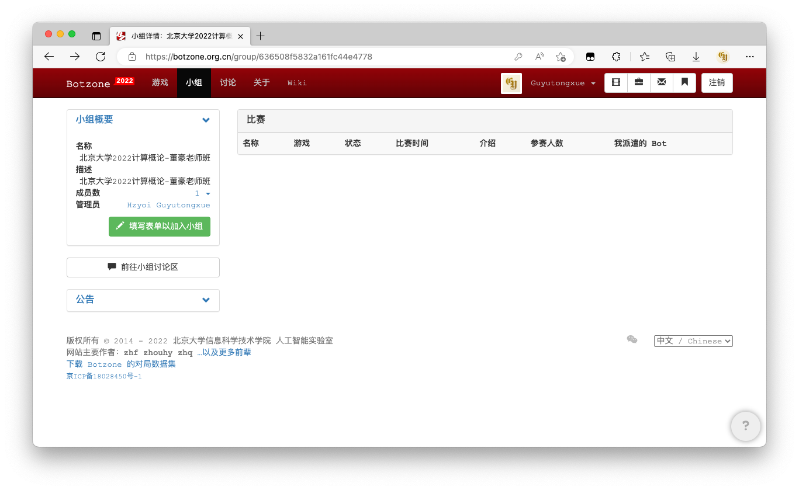
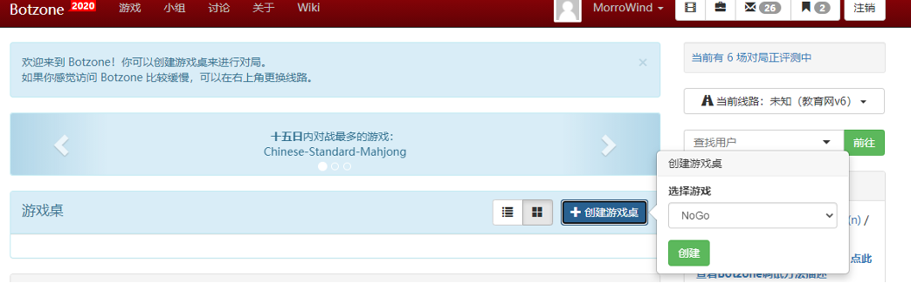
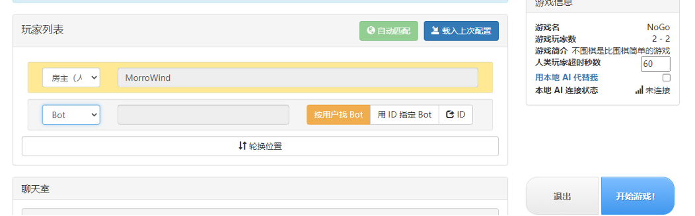
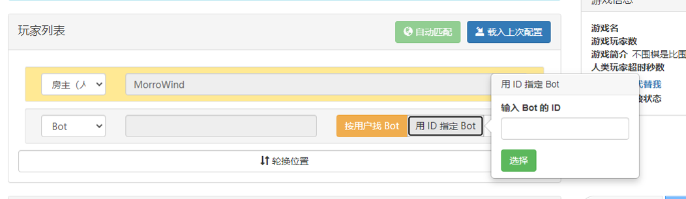
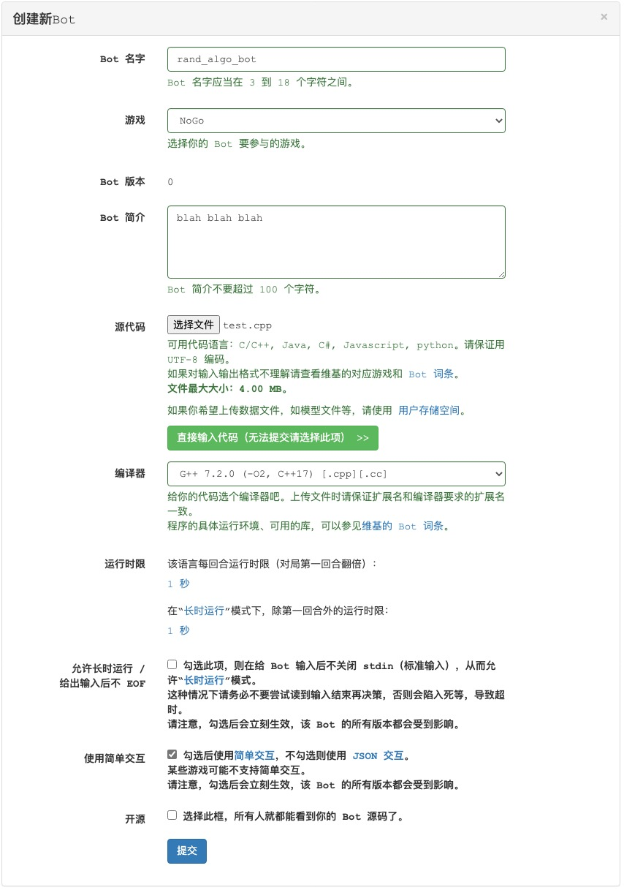

# Botzone 使用方法

## 注册账号

前往 [Botzone](https://botzone.org.cn)。点击右上角的“注册”按钮，填写必要的信息完成注册。

## 加入小组

注册并登录后，前往[小组](https://botzone.org.cn/groups)页面的[董豪班小组](https://botzone.org.cn/group/636508f5832a161fc44e4778)，点击页面左侧的“填写表单以加入小组”按钮。

在表单页面填写你的真实姓名、电子邮箱和学号。组队完成大作业的，只需其中一人加入小组即可。

我们会在之后的某个时间，组织测试赛、正式赛等比赛。请参考[参加比赛](#参加比赛)一节的信息。

## 试玩

注册并登录后，在首页点击“创建游戏桌”，选择游戏“NoGo”。

之后会自动进入游戏桌，需要添加一个 bot 和你进行对战。

你可以去[排行榜](https://botzone.org.cn/game/ranklist/5ab65ae77ec1de5c52e18940)找到一个 bot 并且复制它的 ID。

点击“开始游戏！”即可试玩。

## 观战/复盘

你可以在 Botzone 观看一场对局。点击[对局列表](https://botzone.org.cn/globalmatchlist?game=5ab65ae77ec1de5c52e18940)中的任何一场对局即可。

## 创建 Bot

登录并注册后，在右上方头像的下拉栏中，点击[我的 Bot](https://botzone.org.cn/mybots)。

点击右上方的“创建新 Bot”。请按照说明或下方图片设置 Bot 信息并提交：

- 名字：按要求随意填写
- 游戏：**务必选择 NoGo**
- 简介：按要求随意填写
- 源代码：上传 Bot 代码的 C++ 源文件，或者直接输入代码；[如何编写 Bot](./bot)
- 编译器：请选择 **G++ 7.2.0**
- 允许长时运行：**不勾选**
- 使用简单交互：**勾选**
- 开源：随意

成功提交后，在[我的 Bot](https://botzone.org.cn/mybots) 页面的左侧即可看到该 Bot 有关的信息。你可以点击其中的“+”按钮来更新版本。你也可以让该 Bot 参加比赛或排行榜。

## 参加排行榜

登录并注册后，在右上方头像的下拉栏中，点击[我的 Bot](https://botzone.org.cn/mybots)。

在页面左侧可以看到你提交的所有 Bot。选择你想要参加排行榜的 Bot，点击“排名分”按钮即可参加排行榜。

## 参加比赛

::: info

未完待续

:::
