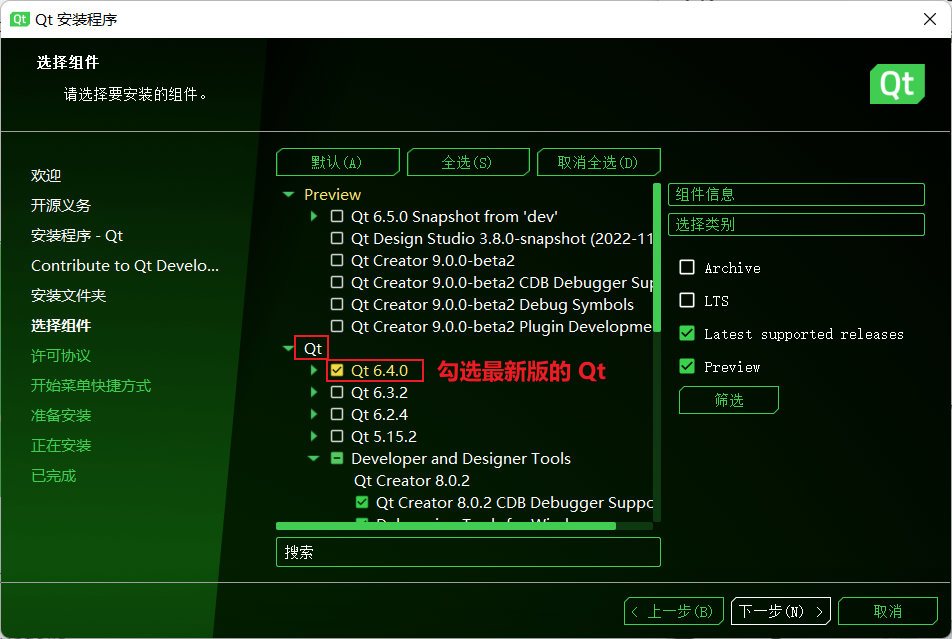
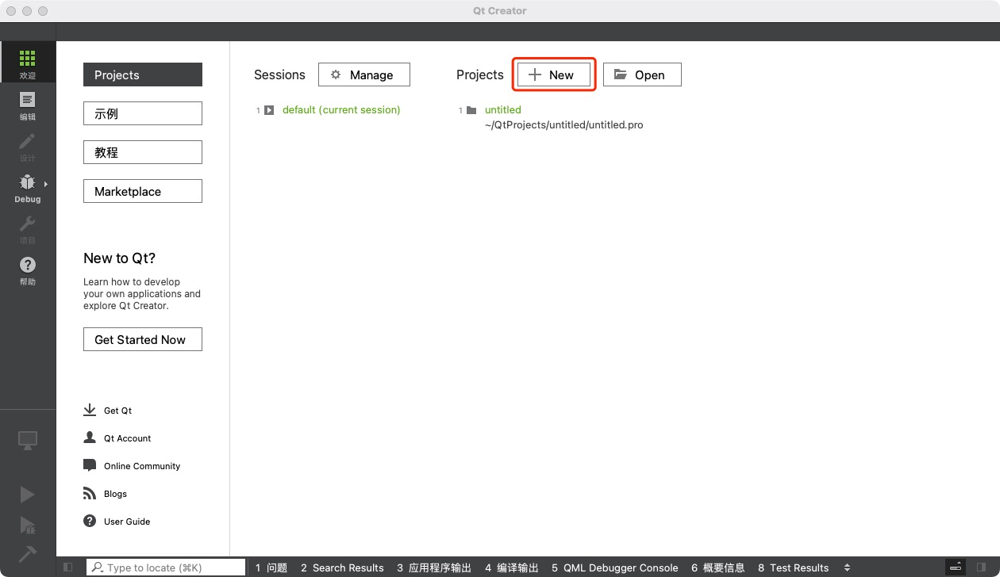

# 关于 GUI 开发


> 2021 级沈大为同学的计概 A 大作业《同化棋》

GUI，即 Graphics User Interface，图形用户界面。我们日常能接触到的大部分计算机程序，都是图形界面的，比如浏览器、Office、VS Code 等等。但编写图形界面应用程序的复杂度，相比普通的基于输入输出的应用程序要困难得多。

现代的图形界面程序，其复杂程度不是我们大一学生能够妥善处理的（当然你可以<ruby>试试<rt>逝世</rt></ruby>）。但是，我们可以回顾一下历史——上个世纪，有一家公司叫 Borland，它推出了一个简洁的 C 开发环境叫 Borland C，现在已经没人用了。这个 Borland C 提供了一个小型的图形接口 Borland Graphics Interface，简称 BGI。BGI 使用数十个非常简短的函数定义，就可以绘制出简单但是有用的图形界面。在今天，虽然 BGI 已经随着 Borland C 消失在历史长河之中，但是有一些小众的库在 Windows 上模拟了 BGI 的所有接口。

## BGI

::: warning

这一节的内容仅适用于 Windows。目前所有模拟 BGI 的库，都是仅 Windows 的；如果你使用其它操作系统，请跳转到[下一节](#qt)。

:::

中国人大多很懒，许多人抱着上个世纪的 Borland C 的教材学习；而懒惰也催生出了开发模拟 BGI 库的动力。于是，[EGE 图形库](https://xege.org)就这样诞生了。

> 类似的库还有 EasyX，也是模拟 BGI 的绘图库。但它闭源，而且仅支持 VS，我是很不喜欢。别的班助教可能会让同学用这个。

总之，我们要使用一个叫做 EGE 的第三方库，帮助我们完成图形界面的绘制。但引入第三方库对于新手来说是一个不小的挑战；如果你做好准备了，那我们就继续吧。

### 下载 Xmake 构建管理器

前往 [xmake.io](https://xmake.io/#/zh-cn/guide/installation?id=%e4%bd%bf%e7%94%a8powershell) 下载并安装 Xmake。这个操作对于电脑小白来说或许有一定难度，但你可以自己先鼓捣鼓捣，不会弄的话问问其它同学。

哦对了，请保证网络通畅。（言外之意是……）

### 创建一个新的工作文件夹

你如果很听话的话，你应该电脑上安装了 VS Code。呃——如果没有的话，我建议你取下一个，因为它真的蛮好用的。我在这里就假设你们都安装了吧。然后，你应该已经熟练掌握了使用 VS Code 运行“单文件”C++ 程序的方法了（如果不会的话，就看看[这个](../ide/vscode)）。

但是呢，和往常编程不太一样，我们现在要在原来的工作文件夹之外，**新建一个独立的文件夹**用来写大作业。这是因为，原来的工作文件夹被配置为“单文件编译”，而如果带上第三方库的话，就不能叫“单文件”了。所以，我们需要一个新的地方，使用新的配置。

如果网络条件好的话，你可以直接下载 [vscode-xege-template](https://github.com/Guyutongxue/vscode-xege-template) 这个仓库。里面已经准备好所有你需要的文件（然后你可以跳过接下来所有创建文件的操作）。

### 配置 Xmake

用 VS Code 打开这个新建的文件夹（当然，路径上不要带中文）。新建一个名为 `xmake.lua` 的文件，内容如下：

```lua
add_requires("xege")

target("my-ege-project") -- 注：my-ege-project 可以修改为任意名字。
    add_packages("xege")
    add_files("src/*.cpp")
```

Xmake 提供了第三方库包管理的功能，所以这里直接通过 `add_requires` 和 `add_packages` 就完成了对第三方库的引用。这里的 `add_files("src/*.cpp")` 意思是，所有的源文件都放在 `src` 文件夹里。所以，我们建立一个 `src` 文件夹，在其中新建 `main.cpp` 内容如下：

```cpp
#include <graphics.h>
int main() {
    initgraph(640, 480);
    setfillcolor(RGB(0, 255, 255));
    fillellipse(200, 200, 50, 50);
    setfillcolor(RGB(0, 0, 0));
    setcolor(RGB(0, 0, 0));
    fillellipse(220, 220, 50, 50);
    getch();
}
```

`<graphics.h>` 就是 BGI 的接口文件。你也可以用 `<ege.h>` 外加 `using namespace ege;`。这里的代码，运用 BGI 中定义的一些函数，绘制一个月亮的形状。

接下来，菜单栏“终端”中“新建终端”，键入

```sh
xmake f -pmingw
```

> 如果你电脑上有安装 VS，那么就可以省略掉 `-pmingw`。

Xmake 可能会询问你是否安装依赖库，直接回车确认即可。如果一切顺利，你会看到最终有一个 `ok` 的字样。接下来，执行

```sh
xmake b
xmake r
```

就可以编译并运行你的程序了。你应该能看到绘制了图形的窗口弹了出来。在该窗口上，按任意键盘上的按键退出程序。


### 启用 VS Code 的智能提示

VS Code 第一次肯定会告诉你 `<graphics.h>` 找不到之类的错误。这是因为我们没有配置关于智能提示的设置。你可以做这样的操作：新建文件 `.vscode/c_cpp_properties.json`，写入：

```json
{
  "version": 4,
  "configurations": [
    {
      "name": "Win32",
      "compileCommands": "${workspaceFolder}\\.vscode\\compile_commands.json"
    }
  ]
}
```

然后，运行命令

```sh
xmake projects -kcompile_commands .vscode
```

即可。你如果直接从 GitHub 上下载了我提供的模板，则可以 Ctrl+Shift+P ，“Run Tasks” 中运行 “update intellisense”。如果你还安装了[Xmake VS Code 扩展](https://marketplace.visualstudio.com/items?itemName=tboox.xmake-vscode)，则还可以运行 “Xmake: Update IntelliSense” 命令。一般这个操作只用做一次，智能提示失效的时候再重新执行就可以。

### 运行快捷键

F6 运行的话，则稍微复杂一点。最简单的，你直接上 GitHub 把[这个文件](https://github.com/Guyutongxue/vscode-xege-template/blob/main/.vscode/tasks.json)的内容存放在 `.vscode/tasks.json` 里就 OK 了。手动写的话，就在 `.vscode/tasks.json` 中存放如下内容：

```json
{
  "version": "2.0.0",
  "tasks": [
    {
      "label": "xmake build",
      "group": {
        "kind": "build",
        "isDefault": true
      },
      "command": "xmake",
      "problemMatcher": "$gcc" // 如果你使用 MSVC，请更改为 $msCompile
    },
    {
      "label": "run and pause",
      "dependsOn": "xmake build",
      "type": "pause-console",
      "command": "xmake",
      "args": [
        "r"
      ],
      "problemMatcher": []
    }
  ]
}
```

关于 BGI/EGE 的使用，你可以在百度上搜索“graphics.h”。你还可以参考 EGE 的[官方文档](https://xege.org/manual/)。具体的我不太懂，就不多说了；请同学们自己探索。

## Qt

Qt 是 C++ 上著名的开发平台、类库、框架、工具集。总之，它提供了各种各样的功能，图形界面什么的自然也就包含在内了。这里推荐它是因为它确确实实在工业界非常常用，可以满足各种级别的需求。相比之下，EGE 之类的只能算是玩具。

### 下载、安装、新建项目

Qt 作为商业公司是要赚钱的，所以它的[下载链接](https://www.qt.io/download-qt-installer)藏得很深。从刚刚的链接点进去，按绿色的“Download”下载在线安装器。接下来，按照安装器的提示完成安装。它可能需要你注册一个账号，你就老老实实注册。这个是免费开源版，不会花钱的。

安装的过程略微繁琐，但大多保持默认选项即可，让你同意啥你就同意啥。惟一需要注意的，就是在“选择组件”的步骤中，点开“Qt”节点，勾选最新版本的“Qt”即可。



安装完成后，你应该能找到一个名为 Qt Creator 的程序，启动它。在 Qt Creator 中，新建项目：



创建的过程保持默认设置（确认一下创建的项目类型是 Qt Widgets Application）即可。之后，Qt Creater 将为你打开这个项目。一个经典的项目内主要包含四个文件：
- `main.cpp` 程序的入口点；
- `mainwindow.h` 窗体的声明文件；
- `mainwindow.cpp` 窗体的定义文件（你大部分代码都会写在这里）；
- `mainwindow.ui` 窗体的设计文件（用来定义图形界面组件的）。

在进行下一步操作之前，你可能需要稍微提前了解一些——不属于这门课授课范围内的——关于类和对象的 C++ 语法。你可以选择简单阅读一下[我的教程第五章](https://learn-cpp.tk/ch05)。但不读也没关系。

### 观察  `main.cpp`

`main.cpp` 定义了我们熟知的 main 函数。这里的细节不用太在意，你只要注意到这里的 `MainWindow w; w.show();` 这两句就 OK。这表明，程序新建了一个 `MainWindow` 类型的变量 `w`，它代表程序运行的主窗体。而 `w.show()` 则是显示这个窗体的意思。

### 修改 `mainwindow.h`

这里定义了一个“类” `MainWindow`。所谓的“类”，就是“结构体类型”的加强版。但这些都不重要，你需要做的是，在这个类的定义里面（就是 `Q_OBJECT` 下面一行左右的位置），加上这么几行字（还有对应的 `#include`）：

```cpp
// 加上这两个 #include
#include <QPainter>
#include <QMouseEvent>

// ...

class MainWindow : public QMainWindow {
    Q_OBJECT
    // 这个位置加上下面三行：
protected:
    void paintEvent(QPaintEvent*) override;
    void mousePressEvent(QMouseEvent*) override;

public:
   // ...
}
```

效果是给这个类增加了两个“成员函数”的声明，它们的具体意思就先不讲了。

### 修改 `mainwindow.cpp`

这里的大部分内容都不用动。你需要做的是，在这个文件的全局的任意位置加上刚刚两个“成员函数”对应的定义：

```cpp
void MainWindow::paintEvent(QPaintEvent*) {
    QPainter painter(this);
    // 这里写绘图用的代码...
}

void MainWindow::mousePressEvent(QMouseEvent* e) {
    // 这里写处理鼠标事件用的代码...
}
```

意思是什么呢？当窗体每次被绘制的时候，`MainWindow::paintEvent` 这个函数就会被执行。你可以在这里用 `QPainter` 绘制棋盘、棋子等图形。

此外，当窗体的某个位置被点击的时候，`MainWindow::mousePressEvent` 这个函数就会被执行。关于鼠标按键、鼠标位置的信息会被保存在一个结构体里，而这个函数的指针类型参数 `e` 就指向这个结构体。你可以在这里调用 `repaint();` 函数来重新触发窗体的绘制。举一个例子：

```cpp
int mouseX = 0;
int mouseY = 0;

void MainWindow::paintEvent(QPaintEvent*) {
    QPainter painter(this);
    // 在鼠标位置的右下方画一个 100x100 的圆形
    painter.drawEllipse(mouseX, mouseY, 100, 100);
}

void MainWindow::mousePressEvent(QMouseEvent* e) {
    // 记录鼠标位置，然后触发重绘
    mouseX = e->pos().x();
    mouseY = e->pos().y();
    repaint();
}
```

这样的代码，运行之后就会看到每一次鼠标点击后，都会在鼠标位置的右下方画一个圆圈。


模仿类似这样的逻辑，你可以在窗体上绘制各种长方形代表棋盘、按钮，圆形代表棋子；然后通过点击事件的位置，处理相应的程序逻辑并重绘窗体。关于 Qt 绘图的资料，可以在百度上搜索“QPainter”。

Qt 还支持基于控件事件的异步编程，使得你可以用按钮、文本框等常见控件控制程序。但相关的扩展语法知识不是这里能写下的了，所以请同学们自行学习（搜索关键词“信号-槽”）。
