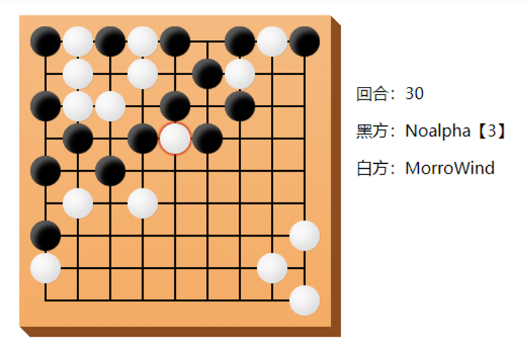

# 不围棋规则

## 目标

想方设法不要让自己提走对方的棋子（围住），尽可能让自己的棋子被对方提走（围住）。

## 术语定义

### 气

一个棋子在棋盘上，与它直线紧邻的空点是这个棋子的“气”。 棋子直线紧邻的点上，如果有同色棋子存在，则它们便相互连接成一个不可分割的整体。它们的气也应一并计算。

### 提走

当一个棋子没有“气”的时候它就要被提走。棋子直线紧邻的点上，如果有异色棋子存在，这口气就不复存在。如所有的气均为对方所占据，便呈无气状态。无气状态的棋子不能在棋盘上存在，也就是提子。把无气之子提出盘外的手段叫“提子”。

## 游戏场地和道具

不围棋是双人游戏，在棋盘上进行。双方玩家各持一色棋子，一般称为黑棋和白棋。

棋盘如图所示，不围棋的棋盘大小是 9x9。注意，这里的 9x9 指的是格点的数目，并不是格子的数量，因为棋子要下在格点上。

## 游戏流程

黑棋先手，双方轮流落子，落子后棋子不可移动。黑棋第一手禁止下在棋盘正中央。

若某方（设为 A 方，对方为 B 方）落子后，棋局满足如下条件之一：
- B 方某一片棋被提走；
- A 方某一片棋被提走（“自杀”）；

则 A 方负，B 方胜。

任何违反规则的落子，如：
- 黑棋第一手落子于棋盘中央；
- 某方某回合不落子；
- 某方落在棋盘外或者落在已有棋子的位置上；

则违反规则的一方负，对方胜。

不存在平局。

## 参考资料

- [Botzone Wiki 上关于 不围棋 的规则定义](https://wiki.botzone.org.cn/index.php?title=NoGo)
