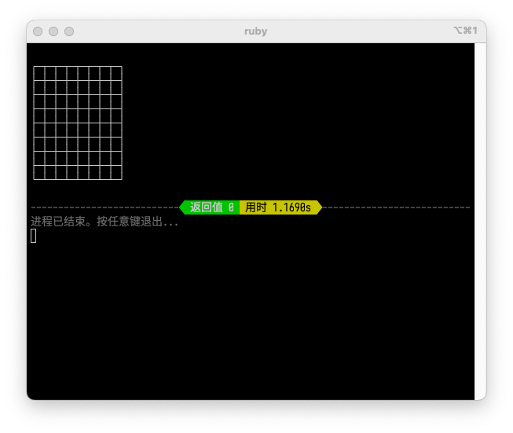
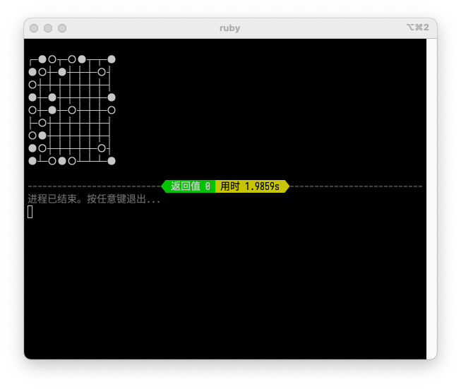
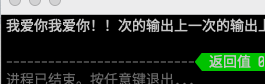
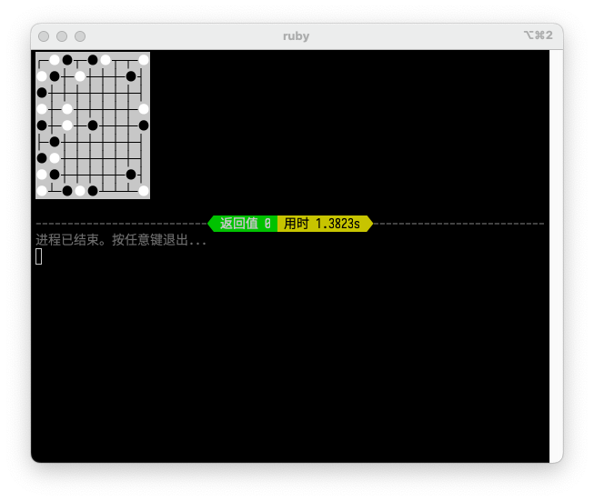

---
# https://github.com/vuejs/vitepress/issues/529
head:
  - - link
    - rel: stylesheet
      href: https://cdn.jsdelivr.net/npm/katex@0.16.3/dist/katex.min.css
  - - link
    - rel: stylesheet
      href: https://cdn.bootcdn.net/ajax/libs/KaTeX/0.16.3/katex.min.css
---

# 关于 TUI 开发


> 2019 级谷雨同学的计概大作业《亚马逊棋》

TUI，即 Text-based User Interface、基于文本的用户界面，也可解释为 Terminal User Interface、终端用户界面。我们之前写的大部分程序，都可以算在 TUI 的范畴内——即用 `std::cin` 输入，用 `std::cout` 输出。

## 初级 TUI

### 用 Windows 同学请注意

我们为了让程序输出不乱码，请引入 `<Windows.h>` 并在 main 函数开头添加 `SetConsoleOutputCP(CP_UTF8);`。

```cpp
#include <Windows.h>
int main() {
    SetConsoleOutputCP(CP_UTF8);
    // 你的其它代码...
}
```

如果你使用 Visual Studio，你还需要“添加 `/utf-8` 编译选项”和“调整源文件编码”两个操作。请参考[这个链接](https://www.jb51.net/article/182665.htm)和[这个链接](https://img-blog.csdnimg.cn/20190123183310312.png)。关于编码（包括如何输入中文等）的知识，请看[这里](../cpp/encoding)。

### 打印菜单

```cpp
#include <iostream>
#include <limits>

// 输入缓冲区最大能存放的字符数量
constexpr std::streamsize MAX_STREAM_SIZE = std::numeric_limits<std::streamsize>::max();

int main() {
    std::cout << R"(不围棋
张三 2200012345
1. 开始游戏
2. 读取存档
3. 退出
请键入你的选择（1~3）
)";
    int n;
    while (true) {
        std::cin >> n;
        if (std::cin.eof() || std::cin.bad()) {
          // 输入为 EOF，或者出现致命错误时，程序终止
          std::exit(0);
        } else if (std::cin.fail()) {
          // 输入失败（输入的不是整数），清空状态并重新输入
          std::cout << "输入不合法，请重新输入" << std::endl;
          std::cin.clear();
          std::cin.ignore(MAX_STREAM_SIZE, '\n');
        } else {
          break;
        }
    }
    std::cout << "你选择了 " << n << std::endl;
}
```

这份代码展示了这样几个要点：
- 使用 `R"(...)"` 这种字符串字面量，可以包含换行。在输出多行内容时颇为有用。
- 当输入一个整数的时候，要考虑各种失败的情形。比如用户模拟了 EOF，或者用户键入了不合法的内容。当遇到 EOF 的时候，程序直接退出就可以了。但其它形式的失败，就需要执行两个操作：一是使用 `cin.clear()` 清除失败状态；二是使用 `cin.ignore(MAX_STREAM_SIZE, '\n');` 忽略一行内容。忽略的原因是，虽然输入失败了，但用户错误的输入仍然残留在缓冲区中（以换行为结尾），所以需要把它们都忽略掉。`MAX_STREAM_SIZE` 是一个很大的值，即尽可能忽略最多数量的字符，直至换行符 `'\n'` 为止。

### 打印棋盘

首先来看打印空棋盘的代码：

```cpp
#include <iostream>
int main() {
    std::cout << R"(┌─┬─┬─┬─┬─┬─┬─┬─┐
├─┼─┼─┼─┼─┼─┼─┼─┤
├─┼─┼─┼─┼─┼─┼─┼─┤
├─┼─┼─┼─┼─┼─┼─┼─┤
├─┼─┼─┼─┼─┼─┼─┼─┤
├─┼─┼─┼─┼─┼─┼─┼─┤
├─┼─┼─┼─┼─┼─┼─┼─┤
├─┼─┼─┼─┼─┼─┼─┼─┤
└─┴─┴─┴─┴─┴─┴─┴─┘
)";
}
```



这里用到一些特殊字符“制表符”（Box-drawing characters）。你可以在[这里](https://unicode-table.com/en/blocks/box-drawing/)找到并复制所有可用的制表符。将这些制表符按照一定的顺序输出，就可以打印出棋盘了。

棋子也可以用两个特殊字符 `○` `●` 来打印。如果你用数组来存储棋局，`1` 代表白棋，`-1` 代表黑棋，`0` 代表空位，则可以这样打印出来：

```cpp
#include <iostream>

int chessboard[9][9]{
    {0,1,-1,0,-1,1,0,0,1},
    {1,-1,0,1,0,0,0,-1,0},
    {-1,0,0,0,0,0,0,0,0},
    {1,0,1,0,0,0,0,0,1},
    {-1,0,1,0,-1,0,0,0,-1},
    {0,-1,0,0,0,0,0,0,0},
    {-1,1,0,0,0,0,0,0,0},
    {1,-1,0,0,0,0,0,-1,0},
    {1,0,-1,1,-1,0,0,0,1}
};

void printBoard(int x, int y) {
    if (x == 0) {
        if (y == 0) std::cout << "┌─";
        else if (y == 8) std::cout << "┐";
        else std::cout << "┬─";
    } else if (x == 8) {
        if (y == 0) std::cout << "└─";
        else if (y == 8) std::cout << "┘";
        else std::cout << "┴─";
    } else {
        if (y == 0) std::cout << "├─";
        else if (y == 8) std::cout << "┤";
        else std::cout << "┼─";
    }
}

int main() {
    for (int i = 0; i < 9; i++) {
        for (int j = 0; j < 9; j++) {
            switch (chessboard[i][j]) {
                case 0:
                    printBoard(i, j);
                    break;
                case 1:
                    std::cout << "● ";
                    break;
                case -1:
                    std::cout << "○ ";
                    break;
            }
        }
        std::cout << std::endl;
    }
}
```



由于字体的原因，上面的代码可能会显示出很奇怪的效果；这时你可以：
- 调整输出前后的空格/格子，使得其显示上一致；
- 或者更改你的控制台字体。比如我推荐[等距更纱黑体](https://github.com/be5invis/Sarasa-Gothic/releases)。然后，调整控制台/终端的设置，选择这个字体即可。

### 落子并刷新棋盘

你可以让用户输入两个坐标，来决定落在哪个位置。同样，你需要进行错误检测。

接下来，我们需要刷新棋盘。Windows 用户请首先在 main 函数开头添加以下代码：

```cpp
#include <Windows.h>
int main() {
    HANDLE hOut = GetStdHandle(STD_OUTPUT_HANDLE);
    DWORD mode{};
    GetConsoleMode(hOut, &mode);
    mode |= ENABLE_VIRTUAL_TERMINAL_PROCESSING | DISABLE_NEWLINE_AUTO_RETURN;
    SetConsoleMode(hOut, mode);
    // 其余代码...
}
```

然后，输出 `\033[H` 这个字符串，就可以将光标定位到屏幕的起始位置。接下来再输出，就会覆盖掉之前的棋盘了。

```cpp
#include <iostream>

int main() {
    std::cout << "上一次的输出上一次的输出上一次的输出上一次的输出" << std::endl;
    // 定位光标到屏幕左上角（初始位置）
    std::cout << "\033[H";
    // 接下来的输出会覆盖“上一次的输出”
    std::cout << "我爱你我爱你！！" << std::endl;
}
```



如果你想清空整个屏幕，输出 `\033[2J` 就可以了。

## 中级 TUI

刚刚介绍的 `\033[H`、`\033[2J`，都叫做 [ANSI 转义序列](https://zh.wikipedia.org/wiki/ANSI%E8%BD%AC%E4%B9%89%E5%BA%8F%E5%88%97)。它们还可以用来控制光标位置、文本颜色等等。

在此基础上，你可以写出这样的代码：

```cpp
#include <iostream>

int chessboard[9][9]{
    {0,1,-1,0,-1,1,0,0,1},
    {1,-1,0,1,0,0,0,-1,0},
    {-1,0,0,0,0,0,0,0,0},
    {1,0,1,0,0,0,0,0,1},
    {-1,0,1,0,-1,0,0,0,-1},
    {0,-1,0,0,0,0,0,0,0},
    {-1,1,0,0,0,0,0,0,0},
    {1,-1,0,0,0,0,0,-1,0},
    {1,0,-1,1,-1,0,0,0,1}
};

constexpr char BOARD[] = "\033[H\033[30m\033[47m" R"(┌─┬─┬─┬─┬─┬─┬─┬─┐ 
├─┼─┼─┼─┼─┼─┼─┼─┤ 
├─┼─┼─┼─┼─┼─┼─┼─┤ 
├─┼─┼─┼─┼─┼─┼─┼─┤ 
├─┼─┼─┼─┼─┼─┼─┼─┤ 
├─┼─┼─┼─┼─┼─┼─┼─┤ 
├─┼─┼─┼─┼─┼─┼─┼─┤ 
├─┼─┼─┼─┼─┼─┼─┼─┤ 
└─┴─┴─┴─┴─┴─┴─┴─┘ 
)" "\033[0m";

int main() {
    std::cout << BOARD;
    for (int i = 0; i < 9; i++) {
        for (int j = 0; j < 9; j++) {
            std::cout << "\033[" << i + 1 << ';' << j * 2 + 1 << 'H';
            switch (chessboard[i][j]) {
                case 1:
                    std::cout << "\033[97m\033[47m● \033[0m";
                    break;
                case -1:
                    std::cout << "\033[30m\033[47m● \033[0m";
                    break;
            }
        }
        std::cout << std::endl;
    }
}
```



这里用到了大量的转义序列，包括：

| 序列 | 含义 |
|---|---|
| `\033[30m` | 设置前景色为黑色 |
| `\033[97m` | 设置前景色为白色 |
| `\033[47m` | 设置背景色为灰色 |
| `\033[0m` | 清除所有颜色设置 |
| `\033[` $x$ `;` $y$ `H` | 设置光标位置为 $(x, y)$，1-起始 |

转义序列提供了多达 256 种颜色设置，还可以用来加粗/加斜/下划线，等等等等。详细的资料可以在[维基百科](https://zh.wikipedia.org/wiki/ANSI%E8%BD%AC%E4%B9%89%E5%BA%8F%E5%88%97)或者[微软文档](https://learn.microsoft.com/en-us/windows/console/console-virtual-terminal-sequences)里找到。

## 高级 TUI

转义序列甚至可以用来读取键盘事件，比如方向键、Esc 键等等。但这个时候，手动处理它们就略显费劲了。我们可以引入一些第三方库来处理它。

最经典的 TUI 库，莫非类-curses 库了。在 macOS 或者 Linux 上，我们经常用 `ncurses` 库；而 Windows 上，则使用 `pdcurses` 库。在程序中引入第三方库对于新手来说是一个不小的挑战，但尝试一下总不是坏处。这里，我们用 Xmake 构建管理工具来引入它们。

请参考[这里](./gui#下载-xmake-构建管理器)的说明，安装好 Xmake。然后，在新建的工作文件夹中编写 `xmake.lua`，内容如下：

<details>
<summary>Windows 系统点击我</summary>

```lua
add_requires("pdcurses", { configs = { port = "wincon"}})

target("my-curses-project")
    add_packages("pdcurses")
    add_files("src/*.cpp")
```

</details>

<details>
<summary>其它系统点击我</summary>

```lua
add_requires("ncurses")

target("my-curses-project")
    add_packages("ncurses")
    add_files("src/*.cpp")
```

</details>

然后，与[刚刚页面](./gui#配置-xmake)上的说明类似，在 `src` 文件夹下，建立一个 `main.cpp` 如下：

```cpp
#include <curses.h>

int main() {
    initscr();
    printw("Hello, World!!!");
    refresh();
    getch();
    endwin();
}
```

运行

```sh
xmake f # MinGW 用户，即不用 VS 的 Windows 用户，请在后面添加 -pmingw 参数
```

进行配置；随后，运行

```sh
xmake b
xmake r
```

编译运行。

类-curses 库的用法，网上也有很多教程，你可以在百度上用“ncurses”作为关键词搜索。[这个英文教程](https://tldp.org/HOWTO/NCURSES-Programming-HOWTO/index.html)看上去也挺不错。
