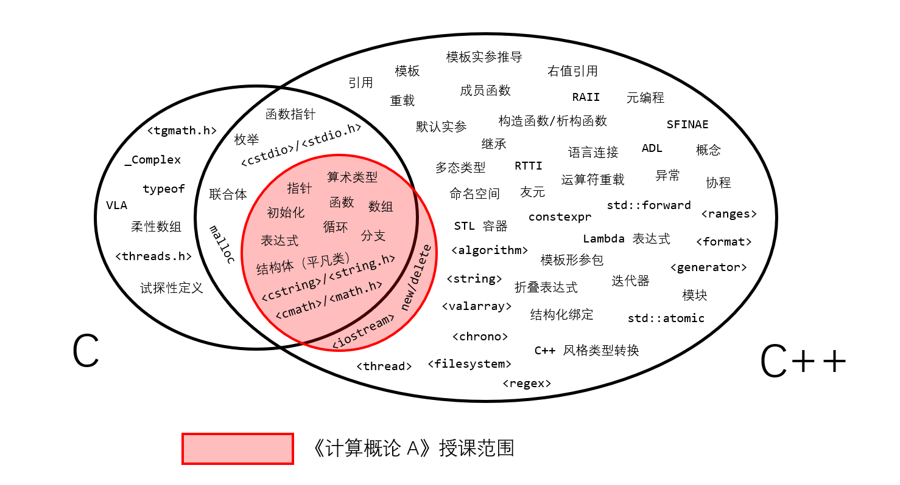

# C++ 与 C 的关系

首先明确一点，C 和 C++ 是两门完全不同的编程语言；C 不是 C++ 的子集，C++ 也不是 C 的超集。



C 语言有许多 C++ 所不包含的语法，更重要的是有很多规则不一样的语法。[这里](https://learn-cpp.tk/ch04/compare_with_c/c_feature.html)尽可能全面地列举了它们。

我们这门课呢，则是以 C++ 作为教学语言。尽管授课范围和 C 有很大的重合部分，但终究不是 C 语言。所以，我们不建议（有 C 基础的同学）使用 C 完成作业或考试。

接下来的篇幅，是给有 C 基础的同学准备的。我希望你们在学习 C++ 时，能把它当成一门全新的语言学习；但 C 的某些特性仍然会造成不少困扰，下面就详细地讲述它们以清脉络。

## 变长数组（VLA）

C 语言允许变长数组（Variable Length Array, VLA），即声明数组时以变量为长度。

```c
int main(void) {
    int n;
    scanf("%d", &n);
    int a[n]; // a 是变长数组
    // [...]
}
```

但在 C++ 里，这 _应当_ 是语法错误。（但，也有部分编译器作为语法扩展而允许其存在，此时请使用 `-pedantic-errors` 类似选项）

换句话说，在 C++ 里**数组长度必须是常量**，也即数组大小必须编译时确定。这本身是一个比较自洽的逻辑：对于声明 `int a[10];`，其语义是声明 `a` 为 `int[10]` 类型的变量。而对于任何**类型**来说，它所占的空间（即 sizeof 于其上）必须是确定的，而不能依赖于一个运行时的变量值。

> 在 C 语言这边，C99 要求编译器必须实现 VLA，但 C11 放宽了要求，改为允许编译器实现（但不强制）。考试用的 Visual C++ 编译器，兼容 C11 标准但不支持 C99，所以它是用不了 VLA 的。因此我在这里要求同学们日常练习时也不能依赖于 VLA。

## 关于命名空间


## 输入输出


## 动态内存分配


## 算法

