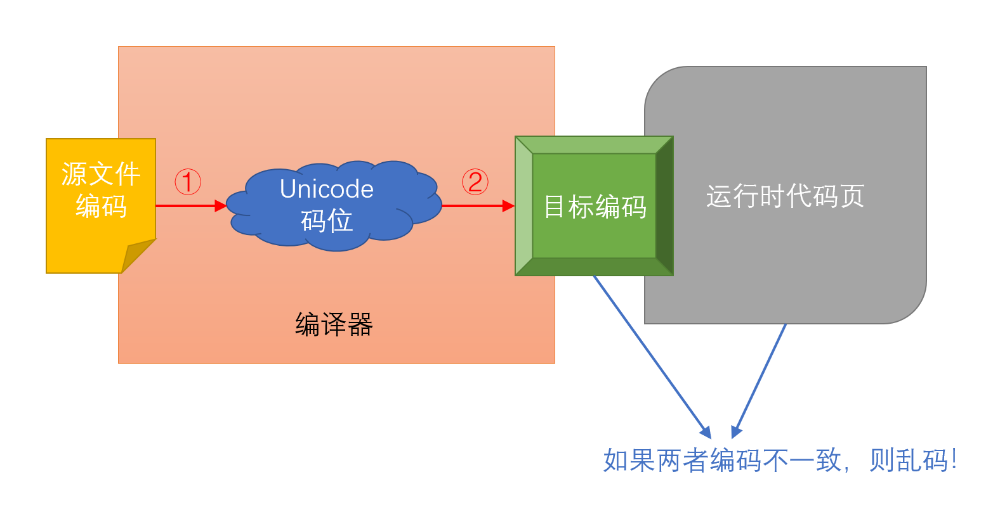

# 关于编码

考虑这个问题：常用汉字有三千多个（事实上所有汉字有将近十万个），而一个字节只能存放 256 个不同的字符。因此，一个字节的大小是放不下汉字的。ASCII 标准（ISO/IEC 646）之定义了 95 个常用英文符号和英文字母；世界上的其它国家在使用本国文字时也会遇到类似问题。

对于本国文字较少的法语、德语等，它们会把这些字母放在首尾为 1 的单字节空间里（因为 ASCII 定义的 128 个字符首位都是 0），这就是 ISO/IEC 8859。每个国家都有自己的定义方法，于是就衍生出了 16 种 ISO/IEC 8859。

而类似中文、日文这种字符数量非常多的语言，大多选择了变长编码；即一个字符可以用多个字节来表示。1980 年，我国推行了 GB/T 2312，规定当某个字节的首位为 1 时，启用双字节编码（这就额外允许了 2 的 15 次方个字符）；从而塞下了六千多个汉字。同时，中国台湾地区的 BIG/5 编码，和日本的 JIS 编码都采用了类似的策略。

微软在向全球推销 Windows 时，对各个地区都做了编码适配；在中国大陆地区则是 CP936 编码（在 GB/T 2312 的基础上添加了更多汉字）。CP936 后来被规范为 GBK 标准；再后来完善为 GB 18030 标准，并添加了四字节编码。

由于各个地区都拥有自己的编码标准，互相交流起来变得非常困难。因此，诞生了统一码（Unicode）联盟，并推出了 Unicode 标准（ISO/IEC 10646）。这份标准为全世界的所有语言都定义了一个**编号**。至于如何将这个编号对应到字节上，有两种常用的方法：

- UTF-8。对于编号小于 128 的字符，使用单字节直接编码；否则，使用两字节、三字节或者四字节编码（取决于编号大小）。特别注意，汉字的编码由于比较靠后，一般是三字节编码，这与 GBK（两字节编码）是不同的。
- UTF-16。总是使用双字节编码；但如果编号太高、双字节放不下，则改用四字节编码。在早期没有四字节编码时，这种“总是双字节”的编码又被称为 UCS-2。

于是你可以看到，中文（至少在中国大陆上）有三种常见的编码：GBK 系列（含 GB/T 2312、CP936、GB 18030）、UTF-8 和 UTF-16。最常用的是 GBK 和 UTF-8，因为它们**兼容 ASCII**：小于 128 的字符总是单字节编码。UTF-16 不是这样，所以下一节暂时不讨论它。

## UTF-8 与 GBK

如果现在有一段中文要在计算机上处理，应该用 GBK 还是 UTF-8 呢？这是一个很矛盾的事情。首先，GBK 系列编码是国家主推的，所以 _据说_ 国家有规定说在中国大陆售卖的计算机必须采用 GB 18030 兼容的编码。而另一方面，UTF-8 是全球通用的；大家都用 Unicode 的话就不用来回来去转换编码。事实上，除了 Windows 外的操作系统，就是指 **macOS 和 Linux，默认设置都是“遍地 UTF-8”的**。

Windows 这边问题变得复杂起来。出于历史原因，Windows 采取了内核与界面分离的设计。在 Windows 内核，采用 UCS-2，后来改成了 UTF-16 的双/四字节编码。而在用户界面，则根据 Windows 的发售地区进行调整；比如在中国大陆上就以 CP936 编码（也即 GBK）显示用户内容；在日本就以 CP932 编码（也即 Shift_JIS）显示用户内容。

这个用户界面的编码有个术语，叫做**代码页**（Code page）。而虽发售地区而改变的、默认的代码页，称为 ANSI 代码页（ANSI Code Page，简称 ACP）；有时也称为 ANSI 编码。

> ANSI 代码页与 ANSI 组织（及其发布的任何编码标准）没有关系；这纯粹是微软的命名失误。

之后的章节就都是在解释 Windows 编码的各种问题了，不过在此之前容许我传教似的向你们推荐这篇文章：[《UTF-8 遍地开花 宣言》](https://utf8everywhere.org/zh-cn)。我们提倡并呼吁，任何人编写程序都应尽可能地使用 Unicode 和 UTF-8 编码。好的，Mac 和 Linux 用户可以关闭此文章了。

## Windows API 的 W 版本和 A 版本

操作系统的一个重要任务，就是向用户程序提供系统调用；在 Windows 上的系统调用称为 Windows API。而刚刚说过，Windows 内核是 UTF-16 的；因此理论上来说用户程序应该使用 UTF-16 调用 Windows API，与内核交互。但这意味着，用户程序需要负责将界面上的 ANSI 编码转换为 UTF-16，并在调用结束后再转换回来——很麻烦。因此，Windows 的大部分调用都提供两个版本：W 版本和 A 版本。

### W 版本

我们先来认识 C/C++ 的一个关键字：`wchar_t`。它是 Wide-character type 的缩写，即“宽字符类型”。什么是宽字符呢？就是比一般的字符（一个字节，普遍是 8 个比特的）更宽的字符类型。在 Windows 上，`wchar_t` 是 16 个比特、两个字节的；刚好对应一个 UCS-2 字符。因此，Windows API 在传递字符串时，使用 `wchar_t` 类型的数组（指针）。

```cpp
// 因此你在 Windows 编程中经常看见这样的类型：

// Pointer to Wide STRing，指向宽字符串的指针
using LPWSTR = wchar_t*;

// Pointer to Const Wide STRing，指向只读宽字符串的指针
using LPCWSTR = const wchar_t*;

// 它们会用在这种 Windows API 上：
DWORD ExpandEnvironmentStringsW(
  LPCWSTR lpSrc,   // 需要传入内核的字符串
  LPWSTR  lpDst,   // 需要传回程序的字符串
  DWORD  nSize
);
```

> 类型中的 `L` 前缀是为了兼容 16 位 Windows 的；在 32 位和 64 位系统上可无视。

注意上面例子中的函数名 `ExpandEnviromentStringsW`，它的结尾是 `W`，表明这是一个 W 版本的 Windows API。W 代表 Wide，即它通过宽字符串传递数据；另一方面也表明它期望 UTF-16 的编码。

### A 版本

还是同样的 API，它的 A 版本长成这样：

```cpp
using LPSTR = char*;
using LPCSTR = const char*;

DWORD ExpandEnvironmentStringsA(
  LPCSTR lpSrc,   // 需要传入内核的字符串
  LPSTR  lpDst,   // 需要传回程序的字符串
  DWORD  nSize
);

```

API 名字的结尾是 `A`，而且它的形参类型也全是指向 `char` 的指针。这表明，你需要传入一些“窄”字符组成的字符串到内核。然而，内核是用 UTF-16 的，它怎么解读这里的“窄”字符呢？答案就是使用 ANSI 代码页。

比软水如果当前系统的 ACP 是 GBK，那么你必须传入符合 GBK 编码规范的一系列 `char` 进去（每个汉字占两个 `char`）。但如果程序在运行时的 ACP 不是 GBK，那内核就会用其它的方式解释这一串 `char`；此时你再传入 GBK 编码的字符进去，得到的就只能是乱码。

> 一个常见的编码错误，就是在 ACP 为 GBK 的 Windows 上运行来自日本的视觉小说游戏。这些游戏的开发者喜欢使用 A 版本 Windows API，并且向他们传入 Shift_JIS 编码（日本地区的 ACP） 的窄字符；它们在日本本地运行良好，但一旦跑到中国大陆，内核就会尝试用 GBK 解释 Shift_JIS 编码，于是你就在界面上看见了奇奇怪怪的乱码。

A 版本 Windows API 很容易造成乱码，因此微软官方不推荐开发者用。但它又非常方便：因为开发者的用户界面都是 ANSI 编码的，如果用 W 版本就需要额外的转换；而且仅仅在本地运行也一般不会有什么乱码。所以，网上的很多代码都会“滥用” A 版本 Windows API，某种程度上不是好事。

A 版本流行还有一个很重要的原因：C++ 标准库的设施里，都是 `char` 更常用；你几乎见不到 `wchar_t` 的存在。更进一步，类似 `std::cin` `std::cout` 之类的基于 `char` 的库设施，底层是要转换到 `WriteConsoleA` 等 A 版本 Windows API 的！换句话，你在不知不觉中，一直在使用不被推荐的 A 版本 Windows API！

> 阅读完这一节，只要智商在线的人都知道 A 版本的 A 是 ANSI 的缩写而不是 ASCII 的缩写。

> 虽然 `std::wcin` `std::wcout` 这类基于 `wchar_t` 的库设施是使用 W 版本 Windows API（如 `WriteConsoleW`）的，但它们问题也挺多的。

## 说好的 UTF-8 遍地开花呢？

UTF-8 遍地开花是一个非常好的理想，所以微软也设置了这样一个代码页（CP65001）。换句话说，如果用户代码页是 CP65001 时，至少他在用户界面上看到的编码就都是 UTF-8 了。

初学者使用 VS Code 和 Dev-C++ 时经常出现乱码。这是因为：

| IDE 环境                                       | 程序员用的编码 | 运行时用的编码 |
| ---------------------------------------------- | -------------- | -------------- |
| VS Code 运行                                   | UTF-8          | GBK            |
| VS Code 调试（但是参考网上说法调整了源码编码） | GBK            | UTF-8          |
| Dev-C++ 5.11 调试                              | GBK            | UTF-8          |
| Dev-C++ 6.x 运行                               | UTF-8          | GBK            |
| Visual Studio（开启 `/utf-8`）                 | UTF-8          | GBK            |

注意，很多 IDE 的运行和调试的代码页是不同的。因为有的调试器会将其所调试的程序的输出代码页转换到 UTF-8（这类软件大多从 Linux 移植而来，以确保兼容性）。因此你会看到这样神奇的现象：
- 一个程序运行的时候乱码，你看了看网上的解决方法，决定将源代码的编码改为 GBK。此时，你程序里的编码和运行时的代码页一致了，没有乱码。
- 然后你发现调试的时候乱码了；因为调试环境下的代码页又变成了 UTF-8。如果你不清楚这些内部原理，你就疯了。

所以，UTF-8 遍地开花在 Windows 上带来了更多的麻烦。如果大家都用 ANSI 编码——GBK——的话，反倒没有什么乱码；但目前的现状是，有些地方是 UTF-8，有些地方不是。于是乱码就开始在这里滋生。

## 字符串字面量的编码

当你在 C++ 中写下：

```cpp
char s[]{"你好，中国！"};
```

时，这个 `s` 是怎么编码的呢？

——这个问题很重要，因为只有当 `s` 的编码与运行时的 ANSI 代码页相同时，程序才不会乱码。一般来说，`s` 的编码与当前文件存储用的编码是一致的。你如果用 VS Code，右下角的信息栏能看到文件的存储编码，默认的字符串编码就是它了。但是（有但是，问题就会复杂），许多编译器为了避免乱码提供了编码转换的功能……



我们的目标，是让可执行文件的编码（即“目标编码”）与运行时代码页（默认为 ACP）保持一致。拿中国大陆举例，我们的 ACP 默认是 GBK，所以为了防止乱码，有三种做法：

1. 让源文件编码为 GBK，编译器不做任何转换。
2. 让源文件编码为 UTF-8（开花！），编译器负责转换到 GBK。
3. 把运行时代码页改为 UTF-8（遍地开花！）。

第一种方法完全不用 Unicode，意味着这个代码只能在中国大陆内使用，而且有些外国文字用不了。不是说不好，只是与我们的哲学不符。第二种方法是目前比较通行的方法；在编译程序时让编译器帮我们做这个转换。第三种方法我们稍后再谈。

编译器转换编码时需要两个步骤：第一步是读取源文件编码（解码，Decode），转换为若干 Unicode 编号的序列。第二步是在生成可执行文件时，将字符串字面量按照目标编码生成（编码，Encode）。在 GCC 中，可以通过两个额外的编译器参数实现：
```sh
g++ ... -finput-charset=utf-8 -fexec-charset=gbk
```
在 Visual Studio 中则是：
```cmd
cl.exe ... /utf-8 /execution-charset=GBK
```

经过这样一番转换后，我们保证了字符串字面量在输出后，用户界面上能够正确地显示它们。顺便一提，我的配置器也是这样操作的。

## 那么输入呢？

暂时解决了“输出字符串”的问题（其实只是解决了字符串字面量），接下来就是输入了。

问题情景如下：用户输入了汉字，程序如何正确读取它们？

首先，`std::cin` 使用 A 版本 Windows API，因此通过 `std::cin` 读到的字符串编码和 ANSI 编码是一致的。换句话说，如果 ACP 为 GBK，则

```cpp
#include <iostream>
int main() {
  char str[1024]{};
  std::cin.getline(str, 1024);
}
```

会让 `str` 中存储 GBK 编码的字符串。只要记住这一点，基本不会遇到什么问题；但有些第三方的库/函数会期望一个 UTF-8 编码的字符串，或者你需要将它和本地的 UTF-8 文件作比较，那你就不能直接用，必须要手动做 GBK 到 UTF-8 的转换。这个说实话蛮费力气的。

所以，为了避免陷入这些琐碎细节，让我们开始真正的 UTF-8 遍地开花吧。

## 真正的 UTF-8 遍地开花

目标：所有的“窄”字符，都用 UTF-8 编码。只有使用 Windows API 时，改用宽的 UTF-16。

### 所有的文件，都用 UTF-8

源代码用 UTF-8 存储。在 Visual Studio 上，可能这个操作会花一些时间（我之后有空再写）。

如果你需要读写文件，确保这些文件也是 UTF-8 编码的。一般情况都是这样。

### 编译器：读取 UTF-8，生成 UTF-8

对于 GCC 和 LLVM，这是默认行为。Visual Studio 偏不，它默认用的编码是 ACP。咱们给它加一个 `/utf-8` 参数纠正一下。

> 我的 VS Code 配置工具在用 MSVC 时会做好这件事情。

### 标准输出，用 UTF-8

如果你用比较新的 Visual Studio（或者 LLVM-MinGW），在 main 函数开头添加：

```cpp
#include <clocale>
int main() {
    std::setlocale(LC_CTYPE, ".utf8");
}
```

否则（老版本 MSVC，或者链接到 MSVCRT 的 MinGW），使用：

```cpp
#include <Windows.h>

int main() {
    SetConsoleCP(CP_UTF8);
    SetConsoleOutputCP(CP_UTF8);
}
```

> 这等价于 `std::system("chcp 65001")`，但 `std::system` 很慢。

### 标准输入可以用 UTF-8 吗？

很遗憾，由于[各种各样的原因](https://github.com/microsoft/terminal/issues/4551#issuecomment-585487802)，即便运行代码页调整为 UTF-8，也无法准确读取到 UTF-8 字符串。

这时，我们必须破例地使用 UTF-16。具体的代码是这样的：

```cpp
#include <Windows.h>
#include <fcntl.h>
#include <io.h>
#include <string>

// 建议使用 GetConsoleMode 确保输入未被重定向
std::string input() {
  // 使 stdin 从 W 版本 API 读取数据
  _setmode(_fileno(stdin), _O_U16TEXT);
  std::wstring ws;
  // 或 std::wcin >> ws; 取决于需求
  std::getline(std::wcin, ws);

  // 使用 Windows API 转换编码
  std::string s;
  auto size = WideCharToMultiByte(CP_UTF8, 0, ws.data(), ws.size(), nullptr, 0, nullptr, nullptr);
  s.resize(size);
  WideCharToMultiByte(CP_UTF8, 0, ws.data(), ws.size(), s.data(), s.size(), nullptr, nullptr);
  return s;
}
```

### 其它地方，都用 UTF-8

由于 ACP 不是 UTF-8 编码，导致用 A 版本 Windows API 很容易出问题。所以，总是使用 W 版本的 Windows API，得到 UTF-16 后再转换。

还有命令行参数。你可以用 `GetCommandLineW`，也可以将 main 函数声明为 `wmain`：

```cpp
int wmain(int argc, wchar_t** argv, wchar_t** envp) {
    // [...]
}
```

还有文件路径。如果你已经做了 `std::setlocale(LC_CTYPE, ".utf8")`，那么一切都 OK；直接用标准库的设施就行。否则，调用 W 版本 Windows API。

> 你可以在编译时，定义 `UNICODE` 和 `_UNICODE` 两个宏。这样，所有不带后缀的 Windows API 都会编译为 W 版本的。

### 好麻烦啊，能不能给力一点？

[Boost.NoWide](https://www.boost.org/doc/libs/1_80_0/libs/nowide/doc/html/index.html) 欢迎你。

## 可不可以 UTF-16 遍地开花？

在 Windows 上，OK。你的代码里可以全是 `std::wstring` `std::wcout` `std::wcin`（需要 `_setmode` 一下），然后都用 `wchar_t`，没问题。

但是，这份代码就彻底和跨平台绝缘了；`wchar_t` 在其它平台上大多实现为 32 比特（即 UTF-32）。至少 UTF-8 遍地开花在其它平台上是天生的，`wchar_t` 则两头都得做适配。

此外，标准库用起来会费力一点，比如文件路径之类的东西标准库只接受 `char` 而不接受 `wchar_t`。但你可以直接操作 Windows API，毕竟刚刚说了，已经不用跨平台了。
