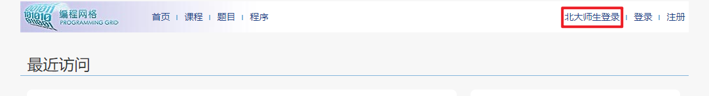
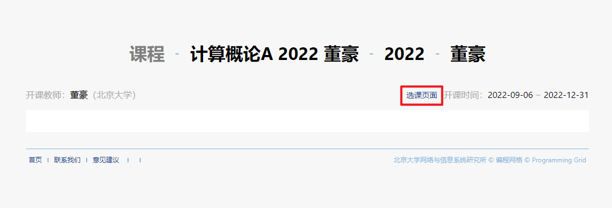
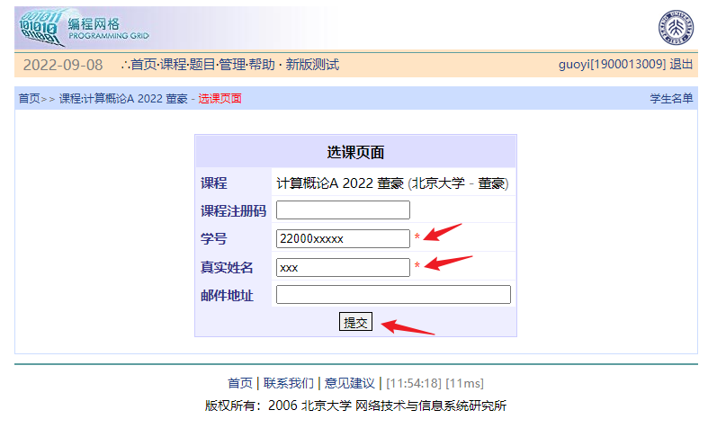
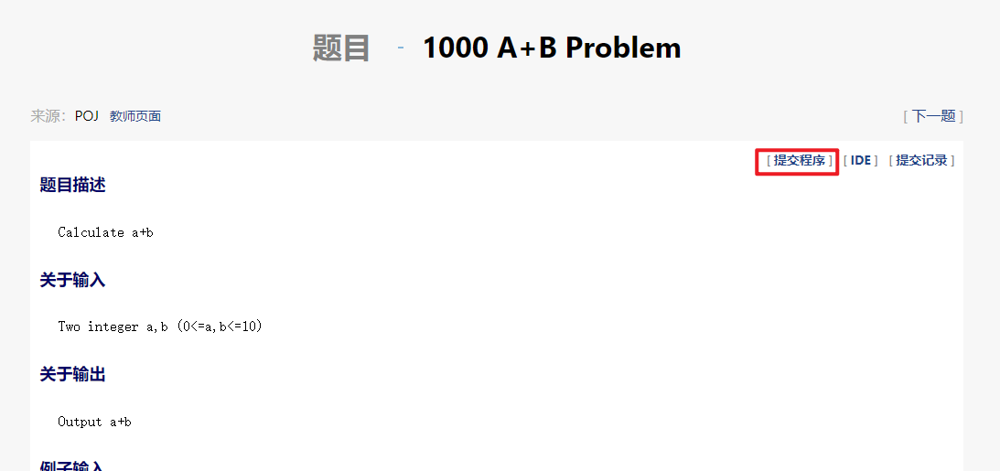
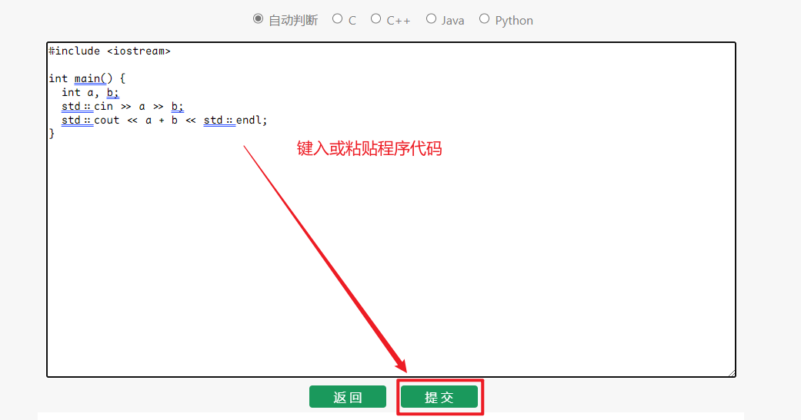
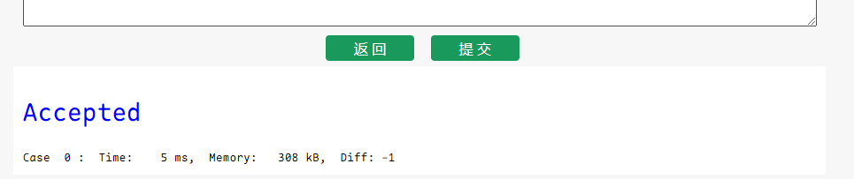

# 编程网格基本使用说明

## 登录

你需要登录才可以使用编程网格。点击页面右上方的"北大师生登录"按钮，然后输入你的北大学号和门户密码以登录。

登录之后，前往[课程页面](https://programming.pku.edu.cn/course/0b0ead5e1550494cb060fca75d9e2604/)，就可以看到作业列表了。

## 选课
如果你还没有选课，你需要选课才可以完成作业或考试。点击标题下方的“选课页面”：

填写“学号”和“真实姓名”后，点击“提交”按钮，然后耐心等待。老师会尽快批准你的选课申请。

## 阅读题目并提交代码

点击对应的作业标题，就可以看到作业题目列表了。每次作业都有截止期限，超过截止期限后无法提交，请同学们务必留意。

点开题目，即可阅读题目信息。点击右上方的“提交程序”按钮来提交代码：

## 查看提交结果

提交之后，下方便会显示此次提交的结果。

一般地：
- `Accepted` 代表这段代码通过了网站的测试，认为是正确答案；
- `Wrong Answer` 代表这段代码在某次测试中给出了错误的响应，你可能需要更正；
- 其它可参考[提交结果说明](./submit_result)。

