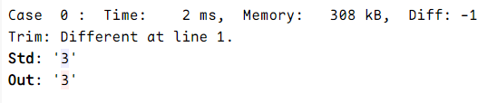

# 编程网格常见问题

## 编程网格的题目时间限制是多少？

编程网格不会显式地告诉你题目运行时间限制，但一般设置为 1 秒。

## 编程网格的题目内存限制是多少？

目前没有明确说法。不过，我建议你视为 65535kiB 左右的限制。

此外，编程网格的评测信息中的 `Memory` 部分似乎是不准确的，可以作为大致参考但不建议根据此数据进行细微调整。

## 提交结果中的 `Diff` 是什么意思？

没有什么意思。

> 其实助教也没搞懂它是什么意思。

## 编程网格可以使用“万能头文件” `<bits/stdc++.h>` 吗？

可以。编程网格使用 GCC 编译器，因此允许该非标准头文件。但是再次强调，考试环境（Visual Studio）下不包含此头文件。我们强烈反对使用它，建议养成使用标准头文件的好习惯。

## 关于行末空格

与部分 OJ 不同，编程网格对行末空白字符**敏感**。对于行末空白字符不同的输出，编程网格会给出 [Wrong Answer](./submit_result#wrong-answer-错误答案)。

## 为什么我的程序 Wrong Answer / Empty Output / …？

请参阅[提交结果说明](./submit_result)。

## 明明输出是对的，为什么告诉我 Wrong Answer？

这种情况很可能是因为你输出了一些不可见字符（比如最常见的 `\0`）。`\0` 虽然看不见，但它在输出中确实存在；评测系统在比较答案时，会认为这个不可见字符是多余的，从而判定为错误答案。因此，你需要小心地处理它们，尤其是在 C 风格字符串的操作上。

## 编程网格使用的语言标准是？

C++14，带 GNU 扩展。默许若干 C++17 语法。

## 同样的输入，为什么在编程网格就出错了呢？

有的时候，同样的程序、同样的输入，在不同的电脑（或者网站）上却得到不同的结果。这很可能因为你的代码存在**未定义行为**。

我在[这里](../cpp/ub)列举了一些常见的未定义行为，请请尽量避免它们。
